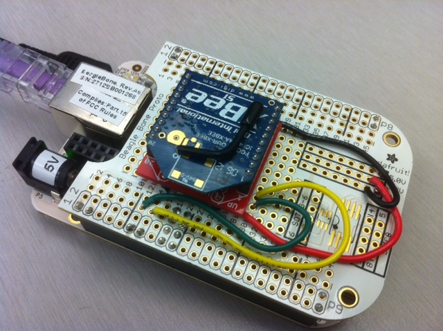

#UART configuration for XBee

###Goal: to connect the Xbee radio to the UART of the beagle.

There are four serial ports on the beagle bone expansion headers. 
UART ports 1, 2, 4 ports have TX, 
Rx, RTS and CTS signals while UART5 only has TX and RX. UART 3 is NOT available 
for use.

I chose to use UART4 because the pins were in a nice location.

##Wiring

I soldered the XBee header pins to the Xbee breakout board and the break out
board to the beagle proto cape.

I wired pin 11 of the P9 expansion header on the beagle (UART4 RX) to DOUT
on the Xbee breakout board.

I wired pin 13 of the P9 expansion header on the beagle (UART4 TX) to DIN
on the Xbee breakout board.

## Software

The beagle multiplexes its pins, so you need to tell it how you're using them.

<table>

<tr>
<td>UART - Pin</td><td>Filesystem location</td><td>Value (hex)</td><td>Notes</td>
</tr>

<tr>
<td>UART1 - RX</td><td>/sys/kernel/debug/omap_mux/uart1_rxd</td><td>20</td>	 <td>Mode 0 - Input</td>
</tr>

<tr>
<td>UART1 - TX</td><td>/sys/kernel/debug/omap_mux/uart1_txd</td><td>0</td>	 <td>Mode 0 - Output</td>
</tr>

<tr>
<td>UART2 - RX</td><td>/sys/kernel/debug/omap_mux/spi0_sclk</td><td>1</td>	 <td>Mode 1 - Input</td>
</tr>

<tr>
<td>UART2 - TX</td><td>/sys/kernel/debug/omap_mux/spi0_d0</td><td>21</td>	 <td>Mode 1 - Output</td>
</tr>

<tr>
<td>UART4 - RX</td><td>/sys/kernel/debug/omap_mux/gpmc_wait0</td><td>26</td> <td>Mode 6 - Input</td>
</tr>

<tr>
<td>UART4 - TX</td><td>/sys/kernel/debug/omap_mux/gpmc_wpn</td><td>6</td>	 <td>Mode 6 - Output</td>
</tr>

<tr>
<td>UART5 - RX</td><td>/sys/kernel/debug/omap_mux/lcd_data9</td><td>24</td>	 <td>Mode 4 - Input</td>
</tr>

<tr>
<td>UART5 - TX</td><td>/sys/kernel/debug/omap_mux/lcd_data8</td><td>4</td>	 <td>Mode 4 - Output</td>
</tr>

</table>

You can check the configuration:

    cat /sys/kernel/debug/omap_mux/gpmc_wait0
    cat /sys/kernel/debug/omap_mux/gpmc_wpn

For our case (UART4), we do:

    echo 26 > /sys/kernel/debug/omap_mux/gpmc_wait0
    echo 6 > /sys/kernel/debug/omap_mux/gpmc_wpn

Now, `/dev/ttyO4` (that is a captial letter o) is ready to be used as you would
any normal serial port under Linux.

For a sanity test you can just talk directly to the XBee by putting it in configuration
mode. Just send '+++' (with no CR or LF) and wait for it to respond 'OK'.  If
that works, the the hardware is setup correctly.

Note that from the factory, the XBees are configured for 9600 baud, if you
change it to a different baud rate it will remember the change.  You'll have
to communicate at the new baud rate next time.

Here is how to do the whole thing in python:

    #!/usr/bin/python

    import subprocess
    import serial
    import time

    UART4_RX_conf = "/sys/kernel/debug/omap_mux/gpmc_wait0"
    UART4_TX_conf = "/sys/kernel/debug/omap_mux/gpmc_wpn" 

    UART4_RX_val = 26
    UART4_TX_val = 6

    subprocess.call(['echo', str(UART4_RX_val), '>', UART4_RX_conf])
    subprocess.call(['echo', str(UART4_TX_val), '>', UART4_TX_conf])

    print "echo 'UART 4 (TX):'"
    subprocess.call(['cat', UART4_TX_conf])
    print ""

    print 'echo "UART 4 (RX):"'
    subprocess.call(['cat', UART4_RX_conf])
    print ""

    # open serial port
    ser = serial.Serial('/dev/ttyO4')
    ser.baudrate = 9600

    # go into configure mode
    ser.write('+++')
    time.sleep(1)
    print ser.read() # should see 'O'
    print ser.read() # should see 'K'

##Other resources:

[BeagleBone serial ports and Xbees](http://www.jerome-bernard.com/blog/2012/06/04/beaglebone-serial-ports-and-xbees/)
