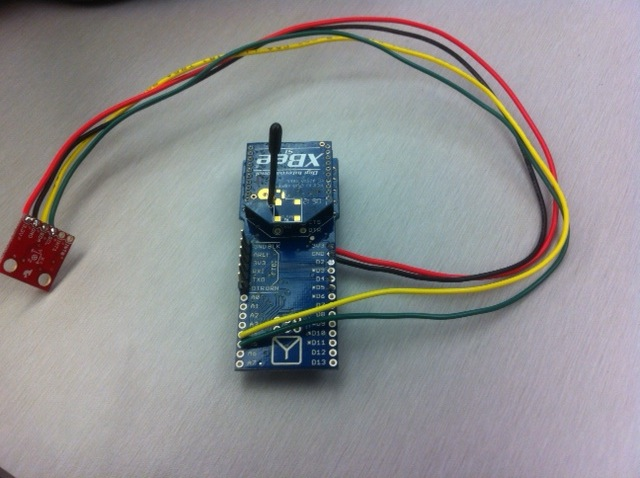

#Arduino Fio with Accel/Gyro combo

The Fio uses analog pins 4 and 5 for I2C. A4 is SDA and A5 is SCL.

3.3V and GND come from their respective pins on the Fio.

Communicating over the XBee is just done with the normal 
[serial library](http://arduino.cc/en/Reference/serial).

An example Arduino sketch to read the device IDs and send them out over XBee:

    #include <Wire.h>

    #define accel_addr  (0x53)
    #define gyro_addr   (0x68)

    void setup() {
        Serial.begin(57600);
        Wire.begin();
    }

    char get_accel_devid()
    {
        char devid;
        readFromAccelAddr(0x00, 1, &devid);
        return devid;
    }

    char get_gyro_devid()
    {
        char devid;
        readFromGyroAddr(0x00, 1, &devid);
        return devid;
    }

    char readFromAccelAddr(char addr, char num, char* buff) 
    {
        Wire.beginTransmission(accel_addr);
        Wire.write(addr);
        Wire.endTransmission();
        Wire.beginTransmission(accel_addr);
        Wire.requestFrom(accel_addr, 1); 
        int i;
        for (i = 0; i < num; i++) {
            while(!Wire.available()); // wait for recv
            buff[i++] = Wire.read();
        }
        Wire.endTransmission();
    }

    char readFromGyroAddr(char addr, char num, char* buff) 
    {
        Wire.beginTransmission(gyro_addr);
        Wire.write(addr);
        Wire.endTransmission();
        Wire.beginTransmission(gyro_addr);
        Wire.requestFrom(gyro_addr, 1); 
        int i;
        for (i = 0; i < num; i++) {
            while(!Wire.available()); // wait for recv
            buff[i++] = Wire.read();
        }
        Wire.endTransmission();
    }

    void loop() {
        Serial.write(get_accel_devid());
        Serial.println("");
        Serial.write(get_gyro_devid());
        Serial.println("");
        delay(500);
    }

