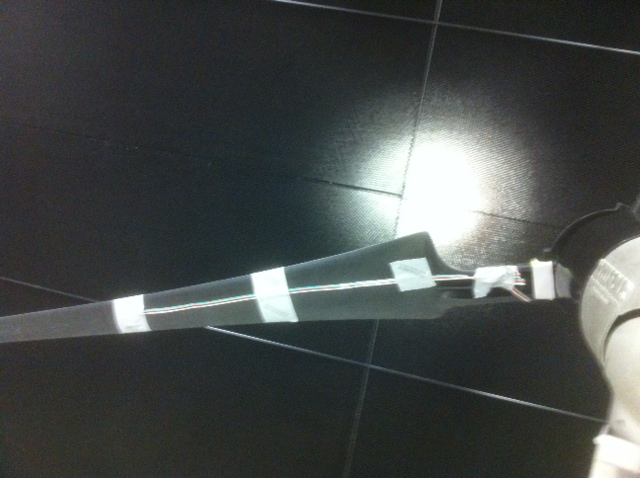

#Fall 2012 End of Semester

Gustavo and Scott went to PCSI to do a data collection.

We put the BeagleBone inside the central cap where the blades come together.

We attached the sensors similarly to how the accelerameters were attached
to the original turbine.

